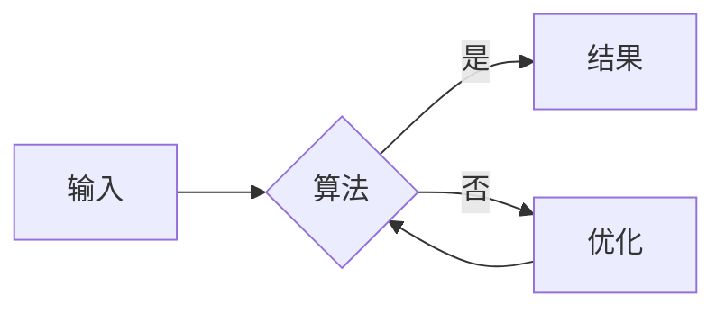

> **本专栏正在建设中，先来聊聊这里会有什么。**

## 这个专栏会推送什么

**算法**是我的核心兴趣之一，这个专栏会持续更新以下内容：

### 1. 数据结构入门与进阶

从数组、链表、栈、队列这些基础结构讲起，逐步深入到树、图、堆、并查集、线段树等进阶结构。每篇文章都会配合**可运行的代码示例**和**复杂度分析**，让你不仅会用，还知道为什么。

### 2. 经典算法套路

- 二分查找的边界处理
- 滑动窗口与双指针
- 动态规划的思考路径
- 回溯与剪枝
- 贪心的证明思路
- 图论：最短路径、最小生成树、拓扑排序

每个套路都会总结成**可复用的模板**，配上 LeetCode / 洛谷的实战题目。

### 3. 刷题笔记

记录我实际刷题过程中的思考过程：拿到题怎么分析、卡在哪里、怎么优化、有没有更优解。比起"标准答案"，我更想分享**踩坑和顿悟的瞬间**。

### 4. 竞赛与实战

偶尔分享算法竞赛（ACM / 蓝桥杯）经验、常见题型的快速识别方法，以及算法在真实项目里的应用。

## 更新频率

计划**每周 1~2 篇**。如果你想看某个具体主题，欢迎在评论区留言 👇

期待在算法的世界里与你相遇。

## 图表渲染测试

